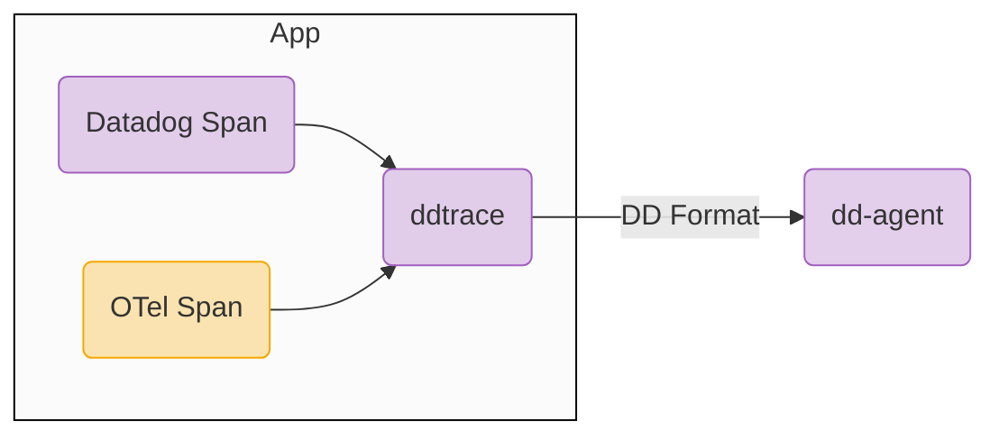

## はじめに
こんにちは 👋 Datadog で分散トレースをしたいとき、Datadog が提供している [Datadog Tracing Library（トレーサー）](https://docs.datadoghq.com/ja/tracing/trace_collection/automatic_instrumentation/dd_libraries/) を使ってアプリを計装できます。表題や下記ドキュメントにあるように Datadog のトレーサーは OpenTelemetry 仕様のスパンを受け取ることができます。この記事ではこの仕様がどういうことか、どういったケースで役立ちそうかを簡単に解説していきます。
https://docs.datadoghq.com/ja/tracing/trace_collection/custom_instrumentation/otel_instrumentation/

アプリをすでに分散トレース計装したことがあり、OpenTelemetry や Datadog の自動計装をふんわり理解しているという前提知識のもとで書いていきます。

## どういうことか
アプリに分散トレース計装を施す場合、大きく分けて以下の準備が必要です。
- `① トレースのセットアップ`（TracerProvider の作成など）
- `② スパンの生成`（計装ライブラリ使用 or カスタムスパン作成）

Python アプリを Datadog のライブラリを用いてトレース計装する場合は、以下のコマンドで自動計装（OpenTelemetry でいうゼロコード計装）されます。
```sh
$ pip install ddtrace
$ ddtrace-run python app.py
```
`ddtrace-run` は Python のプログラムで、アプリ実行時に `① トレースのセットアップ`と、`② スパンの生成`を自動で行います。スパンの生成は `ddtrace` がサポートしてるライブラリやフレームワークがアプリ内で使われている場合、そこに計装ライブラリを動的にアタッチする形（計装ライブラリを使用）になります。このプログラムの中でカスタムスパンを作成したい場合は、`ddtrace` を使って手動でスパンを作成することができます^[カスタムスパンを作成する方法: https://docs.datadoghq.com/ja/tracing/trace_collection/custom_instrumentation/python/dd-api/?tab=decorator]。

このカスタムスパンの作成を OpenTelemetry API を使って行っても、`ddtrace` で生成されるスパンと接続できるという Datadog トレーサーの機能が本記事の趣旨です。



## やってみる
以下のような Python のサンプルアプリ（ [OpenTelemetry Docs](https://opentelemetry.io/docs/languages/python/getting-started/#create-and-launch-an-http-server) から拝借）を使います。
```python:app.py
import time, logging
from random import randint
from flask import Flask, request

from opentelemetry import trace

app = Flask(__name__)
logging.basicConfig(level=logging.INFO)
logger = logging.getLogger(__name__)
tracer = trace.get_tracer(__name__)

@app.route("/rolldice")
def roll_dice():
    player = request.args.get('player', default=None, type=str)
    result = str(roll())
    do_work()
    if player:
        logger.warning("%s is rolling the dice: %s", player, result)
    else:
        logger.warning("Anonymous player is rolling the dice: %s", result)
    return result

def do_work():
    # =================== OpenTelemetry Custom Span ===================
    with tracer.start_as_current_span("This's otel span !!!!") as span:
        time.sleep(0.3)
    # =================================================================

def roll():
    return randint(1, 6)

if __name__ == '__main__':
    app.run(host="0.0.0.0", port="8080")
```

この Python アプリでは一部 `do_work` 関数で OpenTelemetry のカスタムスパンが作成されています。このアプリを Datadog トレーサーで計装し、OpenTelemetry のカスタムスパンを接続するには以下のように環境変数 `DD_TRACE_OTEL_ENABLED` を `true` にすることで実現できます [参考](https://docs.datadoghq.com/ja/tracing/trace_collection/custom_instrumentation/python/otel/#setup)。
```sh
$ export DD_TRACE_OTEL_ENABLED="true"
$ ddtrace-run python app.py
```


Flask は `ddtrace` により自動計装され、スパンが作成されています。さらに OpenTelemetry API で作成したカスタムスパンも繋がっていることを確認することができます。

## 何が嬉しいのか
今回のサンプルではカスタムスパンは一つですが、実際のアプリではより複雑にカスタムスパンを作成している場合も多いと思います。そういったケースで OpenTelemetry API でカスタムスパンを作成しておくことはプロプライエタリの回避という観点で重要です。
例えば、Datadog トレーサーではなく OpenTelemetry のゼロコード計装で Python アプリを計装したい場合は、計装プログラム（[opentelemetry-instrument](https://opentelemetry.io/docs/zero-code/python/#configuring-the-agent)）を変更するだけで容易に切り替えることが可能です。環境によってオブザーバビリティツールが異なる場合にも有効です。
```sh
# === app.py 自体はいずれの場合でも変更する必要はない
$ ddtrace-run python app.py
$ opentelemetry-instrument python app.py # OpenTelemetry の Zero Code Instrumentation ツールを使用
```
:::message
切り替える際の `ddtrace-run` と `opentelemetry-instrument` のサポートライブラリのラインナップやバージョンといった差分や、パフォーマンスの違いは確認する必要があります。
また、今回はゼロコード計装可能な Python を例に挙げましたが、Go など計装コード記述する必要がある場合は、切り替える際にコードの改修が一部必要です。
:::

## まとめ
ニッチではありますが、オブザーバビリティツールとして Datadog を使いながら、カスタムスパンを作成する計装を OpenTelemetry で行う方法について書きました。参考になれば幸いです。

最後に宣伝ですが、Datadog Learning Center に新たに OpenTelemetry を題目にした e-learning が追加されています。興味のある方はぜひ受講してみてください。もちろん無料です。
https://learn.datadoghq.com/courses/otel-with-datadog